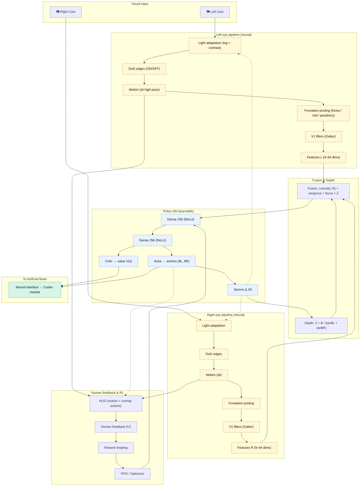

👁️ AI Twin Retina Eyes

A bio-inspired stereo vision system with artificial retina “stations”, eye movements, and learning

Two webcams + two servos (Arduino) + a retina-like pipeline that processes light → edges → motion → foveation before any learning. The goal is not just to “see pixels” but to look and focus like human eyes.

🚆 The “Station/Wagon” Pipeline (What happens to the image)

[A] Light Adaptation (photoreceptors)

Purpose: stable vision in low/high light.

Implementation: x' = log(1 + k·x) + local contrast normalization (divisive on 5×5).

[B] Center vs Surround (bipolar/horizontal) — Edges

Two channels with Difference of Gaussians (DoG):

ON = ReLU( blur_small(x') − blur_big(x') )

OFF = ReLU( blur_big(x') − blur_small(x') )

Why: extracts contours robustly.

[C] Motion (amacrine) — What changes

Temporal high-pass: MOTION = ReLU( x'_t − x'_{t−1} )

Why: highlights moving parts even if color/texture is flat.

[D] Foveation (ganglion scaling) — High res center, compressed periphery

3 rings around gaze center:

Fovea: no pooling (keep detail)

Middle: 2×2 pooling

Periphery: 4×4 (or 8×8) pooling

Output per eye (example minimal):
9 features = [ON1,ON2,ON3, OFF1,OFF2,OFF3, MOT1,MOT2,MOT3]
(sums/means of each channel per ring)

[E] (Optional) V1-like filters — Oriented lines

Few fixed Gabor filters (0°, 45°, 90°, 135°) at 2–3 scales, applied to ON/OFF.

Start frozen (biological priors), later you may fine-tune.

[F] Feature vector

Concatenate L and R eye features + angles (θL, θR) + focus measures + estimated depth Z (from vergence).

This small vector goes into the policy network (MLP or tiny CNN→MLP).

🔧 Stereo Vergence & Eye Movements

Convergence/Divergence with two servos (Arduino).

Depth estimate (rough): Z ≈ B / (tan θL + tan θR) with baseline B in meters.

Saccades (optional): quick gaze jumps to re-center salient motion/edges → the fovea gets fresh detail where needed.

🧪 Initial Training: from “instinct” to skill
0) Boot “instinct”

Motor babbling: tiny random servo nudges to avoid staying frozen.

PID teacher (provided): a simple controller that tries to center a colored object — used to create demo data.

1) Pre-training (Behavior Cloning, BC)

Record sessions (HUD running): (features, angles, target_centered?, keys K/J).

Train a small MLP to imitate the PID + your K (good) / J (bad) corrections.

This gives a safe starting policy.

2) Reinforcement Learning (PPO or DQN)

Reward shaping (dense, easy):

+1 if both eyes keep the target near center (error < ε).

−1 if target lost or at servo end-stops.

small penalty for large, fast oscillations (smoothness).

bonus if Z stays stable while target moves (good vergence).

add human K/J as extra feedback in early episodes.

Curriculum:

static target → learn centering

slow left/right movement

forward/backward (depth)

mixed motion + distractors

3) Fine-tuning

Optionally unfreeze DoG/Gabor to adapt slightly to your optics/lighting.

📊 What to Measure (so it’s science, not “demo”)

Centering error (pixels) per eye (mean, 95th percentile).

Lock time to reacquire after a saccade.

Depth error on known distances.

Oscillation (std of servo velocity).

Success rate over curriculum tasks.
